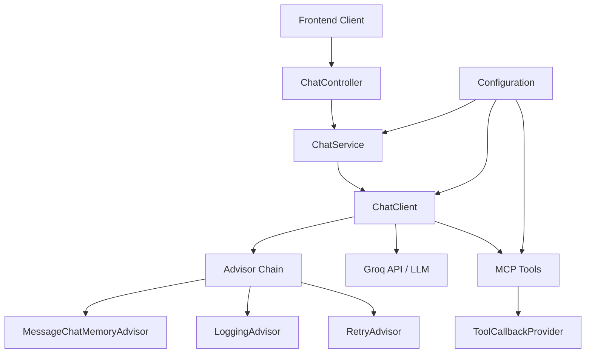
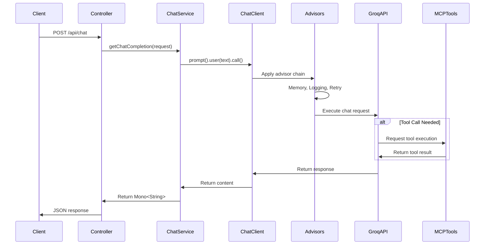

# Design Document: Spring AI 1.1.2 Migration

## Overview

This design document outlines the migration strategy for refactoring the Personal AI Agent project to align with Spring AI 1.1.2 best practices. The migration transforms the current implementation from manual Prompt construction to Spring AI's fluent ChatClient API, introduces Advisors for cross-cutting concerns, implements proper conversation memory management, and enhances MCP tool integration.

The design maintains backward compatibility with the existing REST API while significantly improving code quality, maintainability, and leveraging Spring AI's advanced features including observability, structured outputs, and declarative configuration patterns.

### Key Design Principles

1. **Fluent API First**: Use ChatClient's method chaining for all AI interactions
2. **Declarative Configuration**: Leverage Spring Boot auto-configuration and properties
3. **Separation of Concerns**: Use Advisors for cross-cutting functionality
4. **Type Safety**: Utilize structured outputs for response mapping
5. **Reactive Patterns**: Maintain non-blocking operations with Project Reactor
6. **Testability**: Design for easy mocking and testing

## Architecture

### High-Level Architecture



### Component Interaction Flow



## Components and Interfaces

### 1. ChatService (Refactored)

The core service responsible for AI interactions using ChatClient's fluent API.

**Responsibilities:**
- Initialize ChatClient with proper configuration
- Handle chat requests using fluent API
- Manage conversation context
- Coordinate with advisors

**Interface:**

```java
public interface ChatService {
    /**
     * Process a chat request and return AI response
     * @param chatRequest The incoming chat request with message history
     * @return Mono containing the AI assistant's response
     */
    Mono<String> getChatCompletion(ChatRequest chatRequest);
    
    /**
     * Process a chat request with structured output
     * @param chatRequest The incoming chat request
     * @param responseType The target class for structured output
     * @return Mono containing the mapped response object
     */
    <T> Mono<T> getChatCompletionStructured(ChatRequest chatRequest, Class<T> responseType);
}
```

**Implementation Pattern:**

```java
@Service
@Slf4j
public class ChatServiceImpl implements ChatService {
    
    private final ChatClient chatClient;
    
    public ChatServiceImpl(ChatClient.Builder chatClientBuilder,
                          SystemPromptProvider systemPromptProvider,
                          List<Advisor> advisors,
                          Optional<ToolCallbackProvider> toolCallbackProvider) {
        
        // Build ChatClient with fluent configuration
        ChatClient.Builder builder = chatClientBuilder
            .defaultSystem(systemPromptProvider.getSystemPrompt())
            .defaultAdvisors(advisors.toArray(new Advisor[0]));
        
        // Add MCP tools if available
        toolCallbackProvider.ifPresent(provider -> 
            builder.defaultToolCallbacks(provider));
        
        this.chatClient = builder.build();
    }
    
    @Override
    public Mono<String> getChatCompletion(ChatRequest chatRequest) {
        return Mono.fromCallable(() -> {
            // Use fluent API with conversation history
            ChatClient.ChatClientRequest.CallPromptResponseSpec spec = 
                chatClient.prompt();
            
            // Add message history using fluent API
            for (ChatRequest.Message msg : chatRequest.getMessages()) {
                if ("user".equals(msg.getRole())) {
                    spec = spec.user(msg.getContent());
                } else if ("system".equals(msg.getRole())) {
                    spec = spec.system(msg.getContent());
                }
            }
            
            // Execute and return content
            return spec.call().content();
        });
    }
}
```

### 2. Advisor Configuration

Advisors implement cross-cutting concerns declaratively.

**Components:**

```java
@Configuration
public class AdvisorConfiguration {
    
    /**
     * Provides conversation memory management
     */
    @Bean
    @ConditionalOnProperty(name = "spring.ai.chat.memory.enabled", havingValue = "true")
    public MessageChatMemoryAdvisor messageChatMemoryAdvisor(
            ChatMemory chatMemory) {
        return new MessageChatMemoryAdvisor(chatMemory);
    }
    
    /**
     * Provides in-memory chat history storage
     */
    @Bean
    @ConditionalOnMissingBean
    public ChatMemory chatMemory() {
        return new InMemoryChatMemory();
    }
    
    /**
     * Provides request/response logging
     */
    @Bean
    public LoggingAdvisor loggingAdvisor() {
        return new LoggingAdvisor();
    }
    
    /**
     * Provides retry logic for transient failures
     */
    @Bean
    @ConditionalOnProperty(name = "spring.ai.chat.retry.enabled", havingValue = "true")
    public RetryAdvisor retryAdvisor(
            @Value("${spring.ai.chat.retry.max-attempts:3}") int maxAttempts) {
        return RetryAdvisor.builder()
            .maxAttempts(maxAttempts)
            .backoff(Duration.ofSeconds(1), Duration.ofSeconds(10))
            .build();
    }
    
    /**
     * Provides observability integration
     */
    @Bean
    @ConditionalOnProperty(name = "management.tracing.enabled", havingValue = "true")
    public ObservationAdvisor observationAdvisor(
            ObservationRegistry observationRegistry) {
        return new ObservationAdvisor(observationRegistry);
    }
}
```

### 3. System Prompt Provider

Manages system prompt loading and configuration.

**Interface:**

```java
public interface SystemPromptProvider {
    /**
     * Get the current system prompt
     * @return The system prompt text
     */
    String getSystemPrompt();
    
    /**
     * Reload system prompt from source
     */
    void reload();
}
```

**Implementation:**

```java
@Component
@Slf4j
public class FileSystemPromptProvider implements SystemPromptProvider {
    
    @Value("classpath:system-prompt.md")
    private Resource systemPromptResource;
    
    private String cachedPrompt;
    
    @PostConstruct
    public void init() {
        reload();
    }
    
    @Override
    public String getSystemPrompt() {
        return cachedPrompt;
    }
    
    @Override
    public void reload() {
        try (InputStreamReader reader = new InputStreamReader(
                systemPromptResource.getInputStream(), StandardCharsets.UTF_8)) {
            cachedPrompt = FileCopyUtils.copyToString(reader);
            log.info("System prompt loaded (length: {})", cachedPrompt.length());
        } catch (IOException e) {
            log.error("Failed to load system prompt", e);
            cachedPrompt = "You are a helpful AI assistant.";
        }
    }
}
```

### 4. MCP Tool Integration

Enhanced MCP tool configuration following Spring AI patterns.

**Configuration:**

```java
@Configuration
@ConditionalOnProperty(name = "spring.ai.mcp.client.enabled", havingValue = "true")
public class McpToolConfiguration {
    
    @Bean
    public ToolCallbackProvider toolCallbackProvider(
            McpClient mcpClient,
            @Value("${spring.ai.mcp.tools.timeout:30s}") Duration timeout) {
        
        // Initialize MCP tools with proper error handling
        try {
            List<ToolCallback> callbacks = mcpClient.getTools().stream()
                .map(tool -> ToolCallback.builder()
                    .name(tool.getName())
                    .description(tool.getDescription())
                    .inputTypeSchema(tool.getInputSchema())
                    .function(input -> executeTool(mcpClient, tool, input, timeout))
                    .build())
                .toList();
            
            return new ToolCallbackProvider(callbacks);
        } catch (Exception e) {
            log.error("Failed to initialize MCP tools", e);
            throw new IllegalStateException("MCP tool initialization failed", e);
        }
    }
    
    private String executeTool(McpClient client, Tool tool, 
                              String input, Duration timeout) {
        try {
            return client.executeTool(tool.getName(), input)
                .timeout(timeout)
                .block();
        } catch (Exception e) {
            log.error("Tool execution failed: {}", tool.getName(), e);
            return String.format("Error executing tool: %s", e.getMessage());
        }
    }
}
```

### 5. ChatController (Minimal Changes)

The controller remains largely unchanged to maintain API compatibility.

```java
@RestController
@RequestMapping("/api/chat")
@RequiredArgsConstructor
public class ChatController {

    private final ChatService chatService;

    @PostMapping
    public Mono<ResponseEntity<Object>> chat(@RequestBody ChatRequest chatRequest) {
        return chatService.getChatCompletion(chatRequest)
            .map(content -> ResponseEntity.ok(
                (Object) Map.of("message", 
                    Map.of("role", "assistant", "content", content))))
            .onErrorResume(e -> {
                log.error("Chat request failed", e);
                return Mono.just(ResponseEntity.internalServerError()
                    .body(Map.of("error", e.getMessage())));
            });
    }
}
```

### 6. Configuration Properties

Spring Boot configuration for all Spring AI features.

**application.properties:**

```properties
# Spring AI - Groq API Configuration
spring.ai.openai.base-url=https://api.groq.com/openai
spring.ai.openai.api-key=${GROQ_API_KEY}
spring.ai.openai.chat.options.model=llama-3.3-70b-versatile
spring.ai.openai.chat.options.temperature=0.7
spring.ai.openai.chat.options.max-tokens=2000

# MCP Client Configuration
spring.ai.mcp.client.enabled=true
spring.ai.mcp.client.config-file=classpath:mcp-servers-config.json
spring.ai.mcp.tools.timeout=30s

# Conversation Memory
spring.ai.chat.memory.enabled=true
spring.ai.chat.memory.max-messages=20

# Retry Configuration
spring.ai.chat.retry.enabled=true
spring.ai.chat.retry.max-attempts=3

# Observability
management.tracing.enabled=true
management.metrics.export.simple.enabled=true
management.endpoints.web.exposure.include=health,metrics,info

# Logging
logging.level.org.springframework.ai=DEBUG
logging.level.com.personalai.backend=DEBUG
```

## Data Models

### ChatRequest (Unchanged)

```java
@Data
@NoArgsConstructor
@AllArgsConstructor
public class ChatRequest {
    private List<Message> messages;

    @Data
    @NoArgsConstructor
    @AllArgsConstructor
    public static class Message {
        private String role;
        private String content;
    }
}
```

### ChatResponse (New - for structured outputs)

```java
@Data
@NoArgsConstructor
@AllArgsConstructor
public class ChatResponse {
    private String content;
    private String role;
    private Map<String, Object> metadata;
    private List<ToolCall> toolCalls;
    
    @Data
    @NoArgsConstructor
    @AllArgsConstructor
    public static class ToolCall {
        private String toolName;
        private String input;
        private String output;
    }
}
```

### AdvisorContext (Internal)

```java
@Data
@Builder
public class AdvisorContext {
    private String conversationId;
    private Map<String, Object> attributes;
    private Instant timestamp;
    private String userId;
}
```


## Correctness Properties

*A property is a characteristic or behavior that should hold true across all valid executions of a system—essentially, a formal statement about what the system should do. Properties serve as the bridge between human-readable specifications and machine-verifiable correctness guarantees.*

### Property Reflection

After analyzing all acceptance criteria, I identified the following testable properties. During reflection, I consolidated redundant properties:

- **Conversation context properties (2.1, 2.3, 2.5)**: These all relate to conversation memory working correctly. Combined into Property 1.
- **Error handling properties (7.1, 7.5, 9.4)**: All relate to proper error responses. Combined into Property 6.
- **Response format properties (9.2, 9.3)**: Both verify API compatibility. Combined into Property 7.

### Properties

**Property 1: Conversation Memory Preservation**

*For any* sequence of chat messages with conversation memory enabled, when messages are sent in order, the system SHALL maintain context such that later messages can reference information from earlier messages, and the message order SHALL be preserved in the conversation history.

**Validates: Requirements 2.1, 2.3, 2.5**

---

**Property 2: Advisor Application**

*For any* configured advisor (logging, retry, observability), when a chat request is processed, the advisor SHALL be applied automatically and its effects SHALL be observable (e.g., logs created, retries attempted, metrics emitted).

**Validates: Requirements 3.2**

---

**Property 3: Retry on Transient Failures**

*For any* transient failure (timeout, connection error) during chat requests, when the Retry Advisor is enabled, the system SHALL attempt retries up to the configured maximum attempts before failing.

**Validates: Requirements 3.4**

---

**Property 4: Request/Response Logging**

*For any* chat request processed by the system, when the Logging Advisor is enabled, the system SHALL create log entries containing request details (user message, timestamp) and response details (assistant message, model used).

**Validates: Requirements 3.5**

---

**Property 5: MCP Tool Execution**

*For any* valid MCP tool call requested by the AI model, the system SHALL execute the tool with the provided input, return the tool's output to the model, and include the tool call details in the response metadata.

**Validates: Requirements 4.4**

---

**Property 6: Tool Execution Error Handling**

*For any* MCP tool execution that fails (timeout, invalid input, tool error), the system SHALL catch the error, return a structured error message to the model, and log the failure with sufficient context for debugging.

**Validates: Requirements 4.5, 7.1, 7.5**

---

**Property 7: Structured Output Mapping**

*For any* AI response and target DTO class, when structured output is requested, the system SHALL attempt to map the response to the DTO and either return a valid instance or throw a clear conversion error indicating which fields failed to map.

**Validates: Requirements 5.1, 5.3, 5.4**

---

**Property 8: Multi-Language Response Matching**

*For any* user message in a specific language (Korean, English, Spanish, etc.), the system SHALL generate a response in the same language as the user's message, unless explicitly instructed otherwise.

**Validates: Requirements 6.4**

---

**Property 9: Dynamic System Prompt Updates**

*For any* system prompt update operation, when the prompt is reloaded, subsequent chat requests SHALL use the new prompt without requiring service restart, and the change SHALL be reflected in the AI's behavior.

**Validates: Requirements 6.3**

---

**Property 10: Observability Event Emission**

*For any* chat interaction (successful or failed), when observability is enabled, the system SHALL emit trace events containing request ID, duration, model used, token count, and outcome status.

**Validates: Requirements 7.3**

---

**Property 11: Reactive Error Handling**

*For any* error occurring during reactive chat processing (service error, model error, timeout), the controller SHALL handle the error reactively and return a Mono containing an error response without blocking, and the error response SHALL include an error message field.

**Validates: Requirements 8.3, 9.4**

---

**Property 12: API Backward Compatibility**

*For any* valid ChatRequest DTO from the previous implementation, the migrated system SHALL process the request and return a response with the same structure (message object with role and content fields) as the original implementation.

**Validates: Requirements 9.2, 9.3**

---

**Property 13: Configuration Override**

*For any* Spring AI configuration property with a default value, when an environment variable is provided for that property, the system SHALL use the environment variable value instead of the default, and this SHALL be verifiable through the application's behavior.

**Validates: Requirements 10.2**

---

**Property 14: Configuration Validation**

*For any* invalid configuration value (missing API key, invalid model name, malformed MCP config), when the application starts, the system SHALL fail to start and log a clear error message indicating which configuration property is invalid and why.

**Validates: Requirements 10.5**

---

### Example-Based Tests

The following criteria are best tested with specific examples rather than property-based tests:

**Example 1: Service Initialization**
- Verify ChatClient initializes successfully with default configuration
- **Validates: Requirements 1.5**

**Example 2: MCP Tool Logging at Startup**
- Verify that when MCP tools are configured, startup logs contain tool names and descriptions
- **Validates: Requirements 4.3**

**Example 3: Structured and Unstructured Responses**
- Test requesting structured output (mapped to DTO)
- Test requesting unstructured output (plain string)
- **Validates: Requirements 5.5**

**Example 4: System Prompt Loading**
- Verify system prompt loads from classpath resource at startup
- **Validates: Requirements 6.1**

**Example 5: Health Check Endpoint**
- Verify /actuator/health returns UP status when system is healthy
- **Validates: Requirements 7.2**

**Example 6: Streaming Response**
- Verify Flux-based streaming returns response chunks progressively
- **Validates: Requirements 8.4**

**Example 7: API Endpoint Signature**
- Verify POST /api/chat accepts ChatRequest and returns expected response structure
- **Validates: Requirements 9.1**

**Example 8: Spring Profile Configuration**
- Verify dev profile loads development settings
- Verify prod profile loads production settings
- **Validates: Requirements 10.3**

---

### Edge Cases

**Edge Case 1: Empty System Prompt**
- When system prompt file is empty or contains only whitespace, system should use fallback prompt
- **Validates: Requirements 6.5**

## Error Handling

### Error Categories

1. **Configuration Errors**
   - Missing or invalid API keys
   - Malformed MCP configuration
   - Invalid model names
   - **Strategy**: Fail fast at startup with clear error messages

2. **Runtime Errors**
   - API timeouts
   - Rate limiting
   - Network failures
   - **Strategy**: Retry with exponential backoff, then return error response

3. **Tool Execution Errors**
   - Tool not found
   - Tool timeout
   - Invalid tool input
   - **Strategy**: Catch and return error to model, log for debugging

4. **Conversion Errors**
   - Structured output mapping failures
   - Invalid response format
   - **Strategy**: Return clear error indicating field mismatches

### Error Response Format

All errors follow consistent structure:

```json
{
  "error": "Human-readable error message",
  "code": "ERROR_CODE",
  "timestamp": "2024-01-15T10:30:00Z",
  "details": {
    "field": "Additional context"
  }
}
```

### Retry Strategy

```java
@Bean
public RetryAdvisor retryAdvisor() {
    return RetryAdvisor.builder()
        .maxAttempts(3)
        .retryOn(TimeoutException.class, IOException.class)
        .backoff(Duration.ofSeconds(1), Duration.ofSeconds(10))
        .onRetry((context, throwable) -> 
            log.warn("Retrying request, attempt: {}", context.getRetryCount()))
        .build();
}
```

## Testing Strategy

### Dual Testing Approach

The testing strategy combines unit tests for specific examples and edge cases with property-based tests for universal correctness properties. Both approaches are complementary and necessary for comprehensive coverage.

**Unit Tests** focus on:
- Specific configuration scenarios (Example 1-8)
- Edge cases (empty prompts, invalid configs)
- Integration points between components
- Error conditions with known inputs

**Property-Based Tests** focus on:
- Universal properties that hold for all inputs (Properties 1-14)
- Conversation memory across random message sequences
- Error handling across random failure scenarios
- API compatibility across random valid requests

### Property-Based Testing Configuration

**Library**: Use **jqwik** for Java property-based testing (mature, well-integrated with JUnit 5)

**Configuration**:
- Minimum 100 iterations per property test
- Each test tagged with feature name and property reference
- Tag format: `@Tag("Feature: spring-ai-migration, Property N: {property_text}")`

**Example Property Test**:

```java
@Property
@Tag("Feature: spring-ai-migration, Property 1: Conversation Memory Preservation")
void conversationMemoryPreservesContext(@ForAll List<@AlphaChars @StringLength(min=10, max=100) String> messages) {
    // Given: A sequence of messages
    ChatRequest request = buildChatRequest(messages);
    
    // When: Messages are sent with memory enabled
    String response = chatService.getChatCompletion(request).block();
    
    // Then: Later messages can reference earlier context
    // Verify conversation history contains all messages in order
    List<Message> history = getConversationHistory();
    assertThat(history).hasSize(messages.size());
    assertThat(history).extracting(Message::getContent)
        .containsExactlyElementsOf(messages);
}
```

### Unit Test Examples

```java
@Test
@DisplayName("Example 1: Service initializes successfully with default configuration")
void serviceInitializesSuccessfully() {
    // Given: Default configuration
    // When: Service is created
    ChatService service = new ChatServiceImpl(chatClientBuilder, 
        systemPromptProvider, advisors, Optional.empty());
    
    // Then: Service can process requests
    assertThat(service).isNotNull();
    assertThatCode(() -> service.getChatCompletion(simpleRequest).block())
        .doesNotThrowAnyException();
}

@Test
@DisplayName("Example 7: API endpoint accepts ChatRequest and returns expected structure")
void apiEndpointReturnsExpectedStructure() {
    // Given: A valid ChatRequest
    ChatRequest request = new ChatRequest(List.of(
        new ChatRequest.Message("user", "Hello")));
    
    // When: POST to /api/chat
    ResponseEntity<Object> response = chatController.chat(request).block();
    
    // Then: Response has expected structure
    assertThat(response.getStatusCode()).isEqualTo(HttpStatus.OK);
    Map<String, Object> body = (Map<String, Object>) response.getBody();
    assertThat(body).containsKey("message");
    Map<String, Object> message = (Map<String, Object>) body.get("message");
    assertThat(message).containsKeys("role", "content");
    assertThat(message.get("role")).isEqualTo("assistant");
}
```

### Integration Testing

```java
@SpringBootTest
@AutoConfigureMockMvc
class ChatIntegrationTest {
    
    @Autowired
    private MockMvc mockMvc;
    
    @Test
    void endToEndChatFlow() throws Exception {
        mockMvc.perform(post("/api/chat")
            .contentType(MediaType.APPLICATION_JSON)
            .content("""
                {
                  "messages": [
                    {"role": "user", "content": "Hello"}
                  ]
                }
                """))
            .andExpect(status().isOk())
            .andExpect(jsonPath("$.message.role").value("assistant"))
            .andExpect(jsonPath("$.message.content").exists());
    }
}
```

### Test Coverage Goals

- Unit test coverage: >80% for service and configuration classes
- Property test coverage: All 14 properties implemented
- Integration test coverage: All API endpoints and advisor interactions
- Edge case coverage: All identified edge cases tested

## Migration Strategy

### Phase 1: Foundation (No Breaking Changes)

1. Create new interfaces and configuration classes
2. Implement SystemPromptProvider
3. Set up AdvisorConfiguration with basic advisors
4. Add new dependencies and configuration properties
5. **Validation**: Existing tests still pass

### Phase 2: Service Refactoring

1. Create ChatServiceImpl with fluent API
2. Migrate GroqService logic to new implementation
3. Keep old GroqService temporarily for comparison
4. Add property-based tests for new implementation
5. **Validation**: Both implementations produce same results

### Phase 3: MCP Enhancement

1. Implement McpToolConfiguration
2. Enable MCP client in configuration
3. Add tool execution error handling
4. Add tool-related property tests
5. **Validation**: MCP tools work correctly

### Phase 4: Observability & Polish

1. Add ObservationAdvisor
2. Configure Actuator endpoints
3. Add comprehensive logging
4. Complete all property tests
5. **Validation**: All tests pass, observability working

### Phase 5: Cleanup

1. Remove old GroqService
2. Update documentation
3. Final integration testing
4. **Validation**: Production-ready

### Rollback Plan

Each phase maintains backward compatibility. If issues arise:
1. Revert configuration changes
2. Switch back to old service implementation
3. Disable new advisors
4. All done via configuration, no code changes needed
